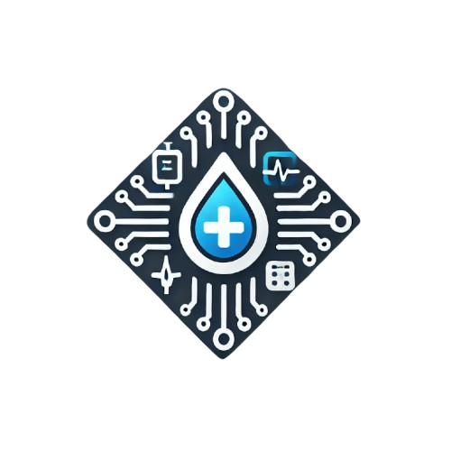

# ℹ️ Tentang DiaWise

DiaWise adalah aplikasi prediksi diabetes berbasis kecerdasan buatan (AI).  
Aplikasi ini menggunakan model machine learning untuk menganalisis data kesehatan pengguna  
dan memberikan hasil prediksi kemungkinan terkena diabetes.

Dengan memasukkan beberapa parameter kesehatan seperti kadar glukosa, tekanan darah,  
indeks massa tubuh (BMI), dan faktor keturunan, aplikasi ini dapat membantu dalam deteksi dini diabetes.

---

Terima kasih telah menggunakan DiaWise! 🚀

Create By Me
